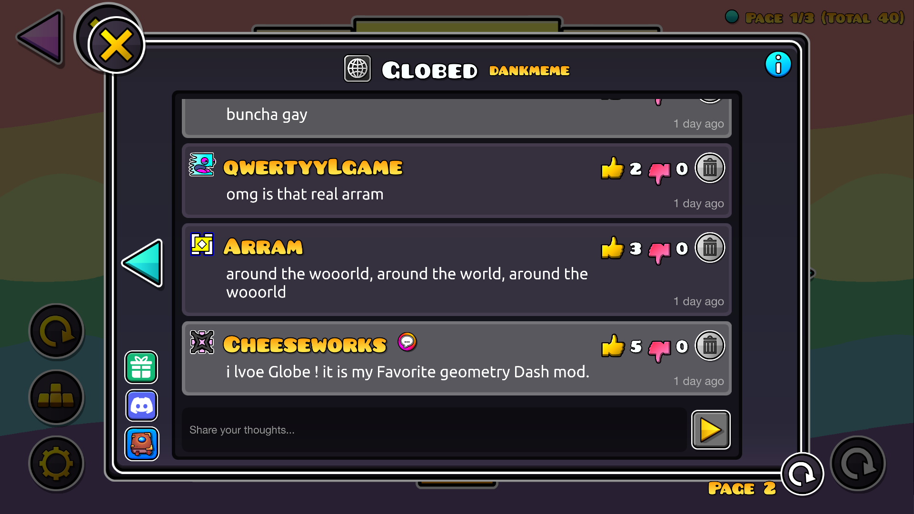

#  Mod Comments
Discuss mods directly in-game.

>   

>  
>  
> 

---

## About
Access **comment sections for mods directly in-game**. Talk about your experience with the mods you've downloaded, and seek feedback from others.

> [!NOTE]
> *This is an **online** mod. **Check [status.cheeseworks.gay](https://status.cheeseworks.gay/)** before reporting any connectivity issues!*

---

### Commenting
On any Geode mod information pop-up, you'll find a tab for comments. Press it to open a new pop-up with comments from people who have downloaded the mod. Feel free to look for others' opinions on that mod, or leave your own!

You can only post comments on mods you currently have installed on your client, but you can always look at comments on *any mod* as long as it's publicly available on Geode!

---

---

### Changelog
###### What's new?!
**[📜 View the latest updates and patches](./changelog.md)**

### Issues
###### What's wrong?!
**[⚠️ Report a problem with the mod](../../issues/)**